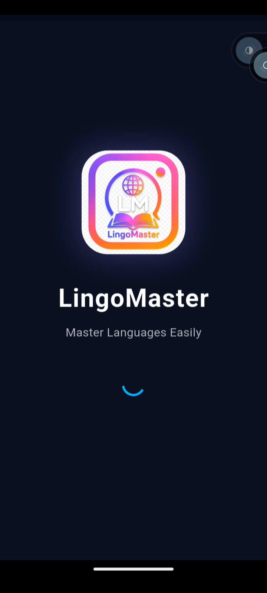
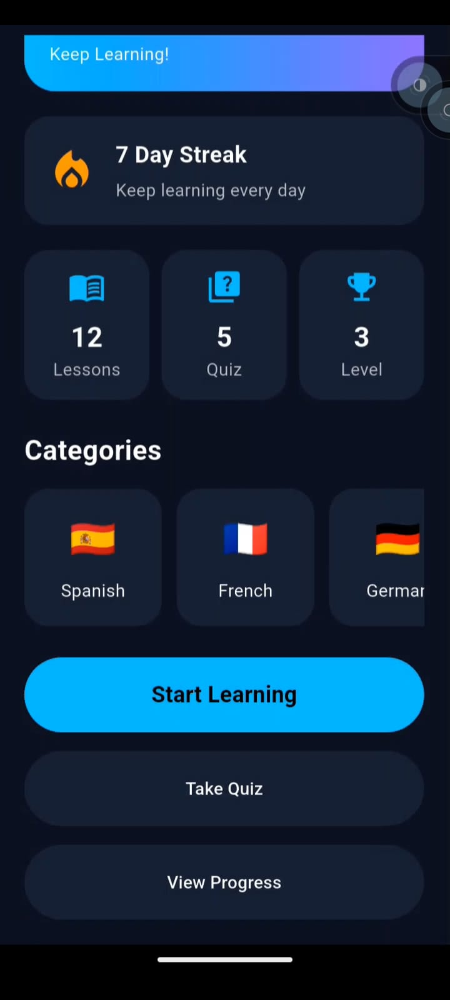
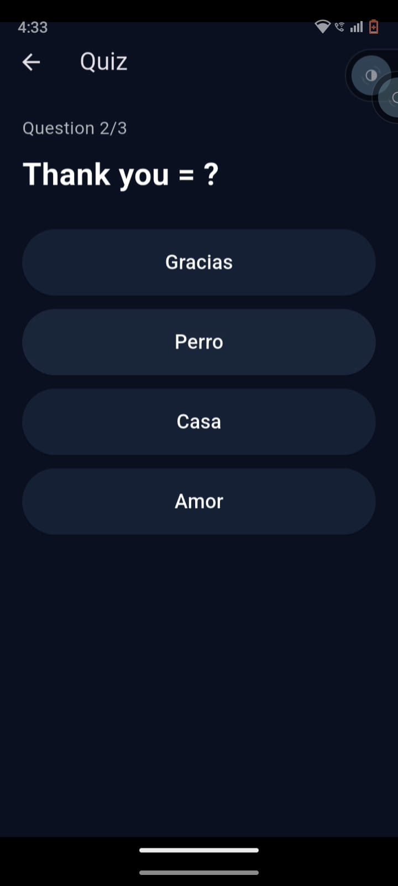
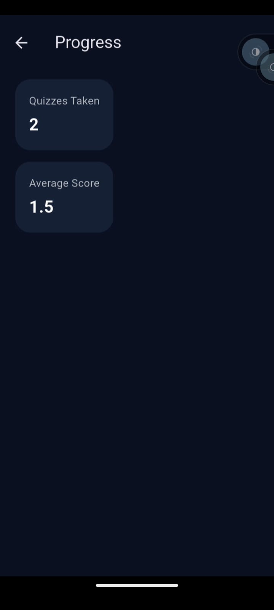

# 🌍 LingoMaster - Language Learning App

A modern Flutter-based language learning application developed as part of the **CodeAlpha Flutter Development Internship**.

The app helps users learn new languages through interactive lessons, quizzes, and progress tracking with a clean and user-friendly interface.

---

## ✨ Features

- 📚 Interactive Language Lessons
- 📝 Quiz System
- 📈 Progress Tracking
- 🔥 Firebase Firestore Integration
- 🎨 Clean & Modern UI
- 📱 Responsive Design
- ⚡ Smooth Navigation

---

## 🛠️ Tech Stack

- Flutter
- Dart
- Firebase Firestore
- Material Design

---

## 📸 App Screenshots

<p align="center">
  
  
  
</p>

<p align="center">
  
  
  
</p>

---

## 📂 Project Structure

```text
lib/
├── models/
├── screens/
├── services/
├── widgets/
└── main.dart
```

---

## 🚀 Getting Started

Clone the repository:

```bash
git clone https://github.com/fatima-awais1122/codealpha_language_learning_app.git
```

Install dependencies:

```bash
flutter pub get
```

Run the app:

```bash
flutter run
```

---

## 👩‍💻 Developed By

**Fatima Awais**

---

## 📄 License

This project was developed for learning purposes as part of the CodeAlpha Flutter Development Internship.
